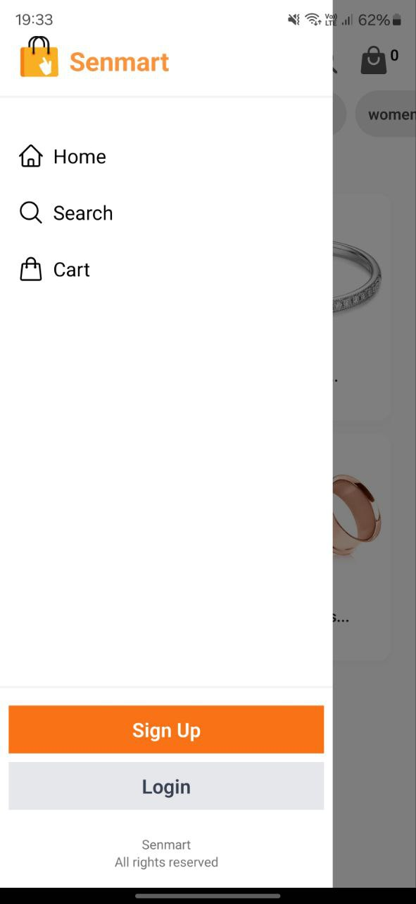
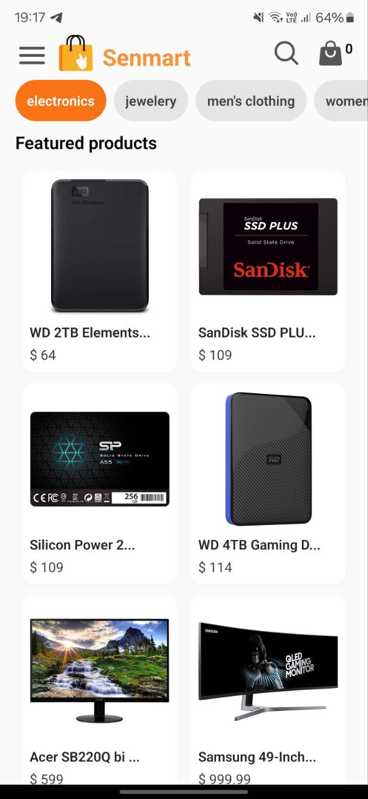
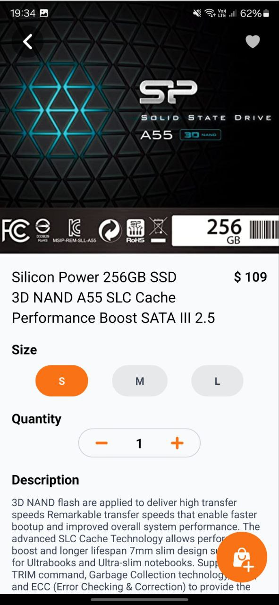

# React Native Redux E-commerce

This is a React Native e-commerce application built with Redux for state management. The app allows users to browse products, add them to the cart, and proceed to checkout. It also includes user authentication features such as login and signup.

## Key Features

- Browse products by categories
- Search for products
- View product details
- Add products to the cart
- Remove products from the cart
- User authentication (login, signup, logout)
- Checkout process

## Demo

<div style="display: flex; gap: 12px;">
    
    
    
    
</div>

## Installation

1. Clone the repository:

   ```sh
   git clone https://github.com/yourusername/react-native-redux-ecommerce.git
   cd react-native-redux-ecommerce
   ```

2. Install dependencies:

   ```sh
   npm install
   ```

3. Start the development server:

   ```sh
   npm start
   ```

4. Run the app on your device or emulator:

   ```sh
   npm run android
   npm run ios
   ```

## Configuration

Make sure to set up your environment variables in a `.env` file at the root of the project:

```
EXPO_PUBLIC_API_URL=https://your-api-url.com
```

## Usage

- Browse products by navigating through categories.
- Search for specific products using the search bar.
- Add products to your cart and view them in the cart screen.
- Proceed to checkout and complete your order.
- Sign up or log in to manage your account and orders.

## Contributing

Contributions are welcome! Please open an issue or submit a pull request for any improvements or bug fixes.

## License

This project is licensed under the MIT License.

---

Feel free to customize this README file according to your project's specific details and requirements.

Nouaaman: saveit as readme

Workspace: # React Native Redux E-commerce

This is a React Native e-commerce application built with Redux for state management. The app allows users to browse products, add them to the cart, and proceed to checkout. It also includes user authentication features such as login and signup.

## Features

- Browse products by categories
- Search for products
- View product details
- Add products to the cart
- Remove products from the cart
- User authentication (login, signup, logout)
- Checkout process

## Installation

1. Clone the repository:

   ```sh
   git clone https://github.com/yourusername/react-native-redux-ecommerce.git
   cd react-native-redux-ecommerce
   ```

2. Install dependencies:

   ```sh
   npm install
   ```

3. Start the development server:

   ```sh
   npm start
   ```

4. Run the app on your device or emulator:

   ```sh
   npm run android
   npm run ios
   ```

## Configuration

Make sure to set up your environment variables in a `.env` file at the root of the project:

```
EXPO_PUBLIC_API_URL=https://your-api-url.com
```

## Usage

- Browse products by navigating through categories.
- Search for specific products using the search bar.
- Add products to your cart and view them in the cart screen.
- Proceed to checkout and complete your order.
- Sign up or log in to manage your account and orders.

## Contributing

Contributions are welcome! Please open an issue or submit a pull request for any improvements or bug fixes.

## License

This project is licensed under the MIT License.

---

Feel free to customize this README file according to your project's specific details and requirements.
